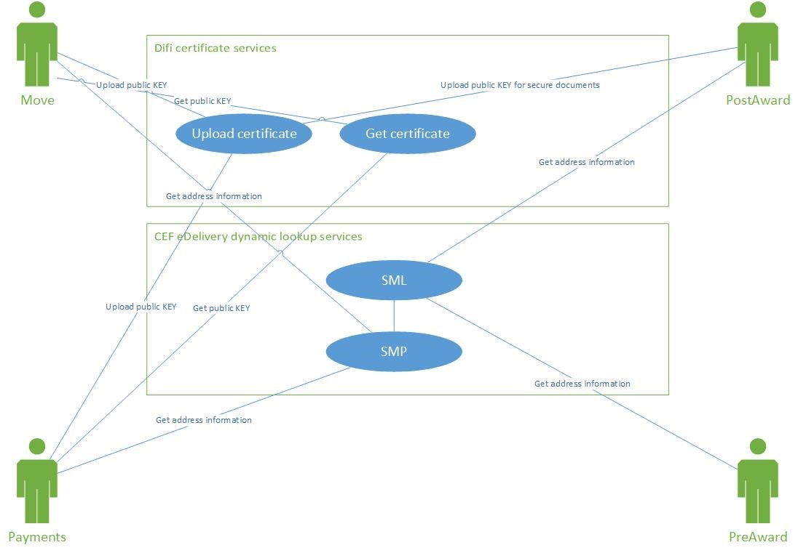
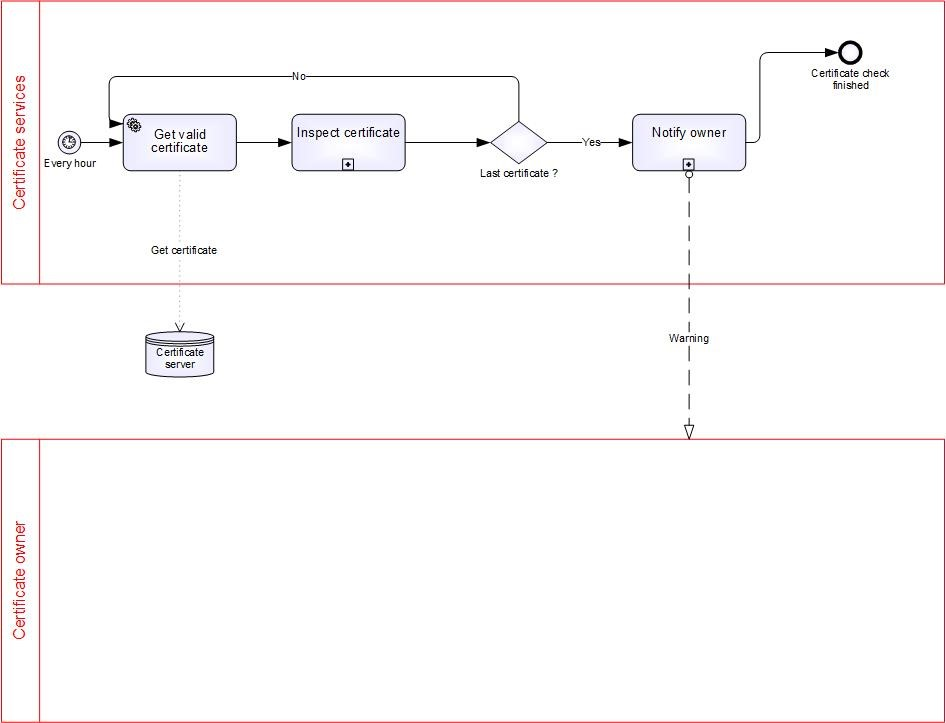
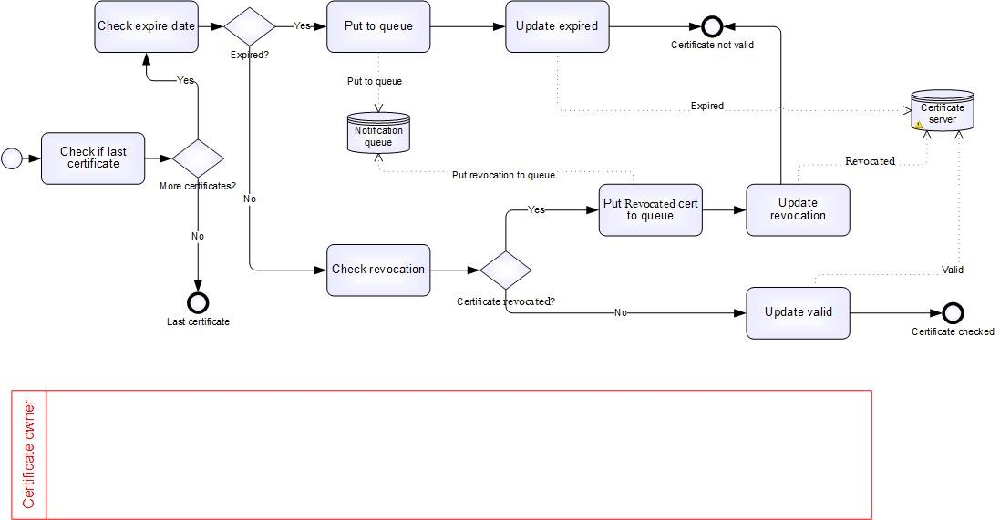
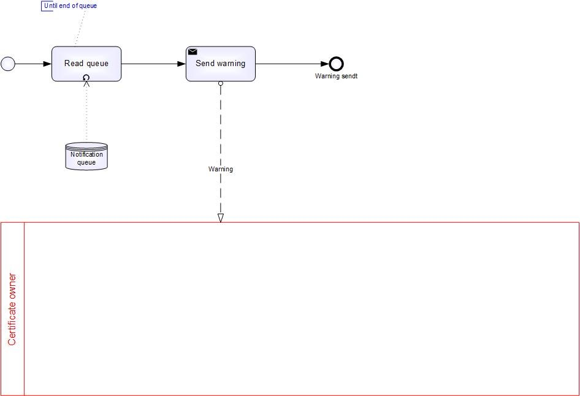
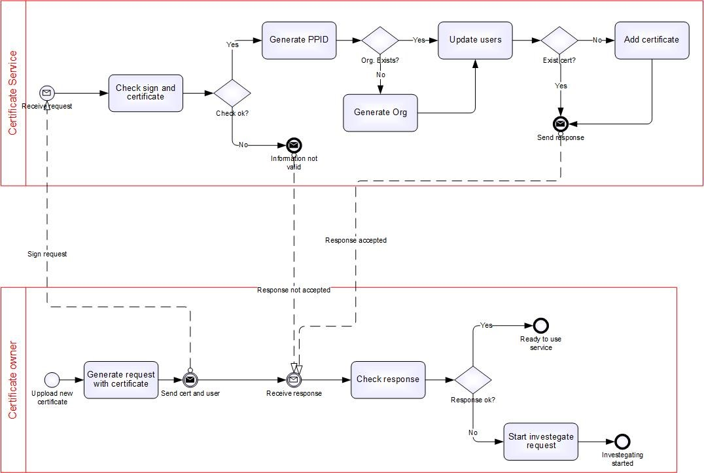
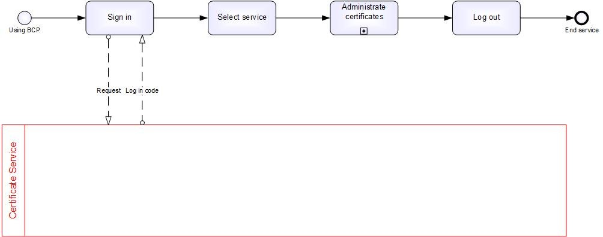

= Business Certificate Publisher Specification
Agency of Public Management and eGovernment
2017-11-24
:doctype: book
:icons: font
:toc: left
:toclevels: 2
:source-highlighter: coderay
:source-language: xml
:sectanchors:
:sectnums:

== Background

Requirements for information security are increasing in most aspects of society.

Difi has a key management role for ensuring security in transaction based systems in various sectors, such as public-to-public, health, invoicing, payments and other systems that are based on an enhanced PEPPOL eDelivery Network.

Based on the assumption that a rapidly increased number of services and data transfers will need information security, we have identified the need to establish an infrastructure or a chain of trust. The proposed infrastructure will make existing PKI trust chains currently provided by the market, available upon request.

At the same time a considerable number of services between the public and private sector, have a comparable need for data protection and security, emphasizing the demand for a scalable trust architecture and easy access to encryption certificates, as required, to support business processes across industries.

== Objective

The purpose of this document is to specify requirements for a Business Certificate Publisher (BCP). The proposed BCP would support various business level processes where information protection is needed in the four-corner model, i.e. Enhanced PEPPOL eDelivery Network.

== Functionality

The BCP will make a business certificate available for solutions that seek to encrypt a document for one or more given receivers. The entity who wants to receive encrypted documents is responsible for making the business certificate available in a structured manner in the BCP. An entity can have many business certificates, organisation numbers and many profiles. When retrieving a certificate for encryption, a combination of organization number and process type is provided.

=== Description

The first version of the BCP will be used to make available, certificates for use in the Enhanced PEPPOL eDelivery Network. The certificate is stored in the server for an organisation number and a given process. Process in this context, means process types such as payments, public-to-public document exchanges and secure Post-Award exchanges (i.e. secured invoices).

The document receiver is responsible for having a correct and valid business certificate in the BCP issued by a trusted Certificate Authority (CA). A receiver may make available multiple certificates and the same certificate can be used in many different processes.

Uploaded certificates must be issued by a trusted Certificate Authority (CA) and in first phase, only certificates issued by Commfides and Buypass are approved. All approved CAs will be listed on https://vefa.difi.no/.

== Control mechanism

The BCP is mainly a service for publishing business certificates in a structured manner. The service will verify registered business certificates at given intervals to make sure revoked and expired certificates are removed from use. It is still important and necessary for users to verify each certificate upon use.

=== Process: Hourly control of certificates and expiry dates

The proposed service will verify each registered certificate for expiration date and revocation. Notifications about upcoming expirations and revocations will be sent to registered users.

=== Process: Verify certificate

This sub-process will check if the certificate is valid.

The sub-process starts with a check if there are more certificates to verify.

The following steps are performed during validation of a given certificate:

* Verify the certificate is not expired.
*	Verify the certificate is not revoked.

All expired and revoked certificates are queued for notification to the registered owner of the certificates.

All valid certificates will be updated in the BCP and all other certificates that are queued, are updated with a status of revoked or expired.

=== Process: Notify certificate owner

This sub-process is to notify the certificate owner if the certificate is revoked or the certificate is expired upon detection.

The sub-process starts with reading all certificates from the notification queue and will send a notification to all certificate owners.

== Initiation of a new organization

This process describes how to initiate a new organization into the BCP.

=== Process: Initiation of a new organization

The main process for approving a new organization with a signed request, included the certificate.

The outcome of this process is to ensure that the certificate owner is who he says he is, to register the new user and to upload the certificate.

The process is initiated by the certificate owner wanting to upload a certificate. The certificate owner will make a “file”, sign it and send it to the certificate service.

The certificate service will then check the signature and the certificate. If the check is not successful, the certificate owner will be notified. If the test is successful, the certificate service will generate the PPID, and the organization (if the organization was not already registered) before the certificate is uploaded. When this is completed, the certificate owner will be notified.

The certificate owner must handle the response with either ‘investigate’ or ‘ready to use the BCP’.
 

=== How to update the BCP

This process describes how to update the BCP.

== Client requirements

Software clients used to fetch certificates from BCP for encryption is expected to use the link:../interface/v1/[BCP Interface v1].

Certificates received must be verified before usage:

* Technical verification
** Expiration
** Key usage
** Certificate chain, including policies
** Critical extensions (recognized and required)
* Checking for revocation
** Use of Online Certificate Status Protocol (OCSP)
** Use of Certificate Revocation List (CRL)

In the case of certificate not being valid must the certificate not be used. When multiple certificates are received on lookup may one or more be invalid and should be discarded silently.

OCSP is seen as the primary mechanism for check of revocation, however use of CRL before OCSP is required to minimize requests to OCSP for known revoked certificates. Temporarily unavailability of OCSP are not to stop verification when certificate is not listed as revoced in CRL.

In the case of lookup response contains no valid certificates must any use of received certificate(s) stop and processes requiring certificate result in failure.

Clients fetching certificates from BCP without proper validation upon reception operates outside the security model for BCP and must not be used at all.

== Processes

There are possibilities for entities to upload many company certificates to the certificate server.  Only certificates associated with one or more processes are made available.

Payments::
This profile is for securing payments between banks and payers. Both banks and payers must upload their certificates.

Invoicing::
This profile is for securing the content of an invoice. Only the invoice receiver needs to upload the certificate.

Ordering::
This profile is to secure the content of an order. It is recommended that both the buyer and the supplier upload their certificates.

Catalogue::
This profile is to secure the content of a catalogue. Only the buyer needs to upload the certificate.

Archive::
This profile is for securing documents between public entities, and it is recommended that all public entities upload their certificates.
